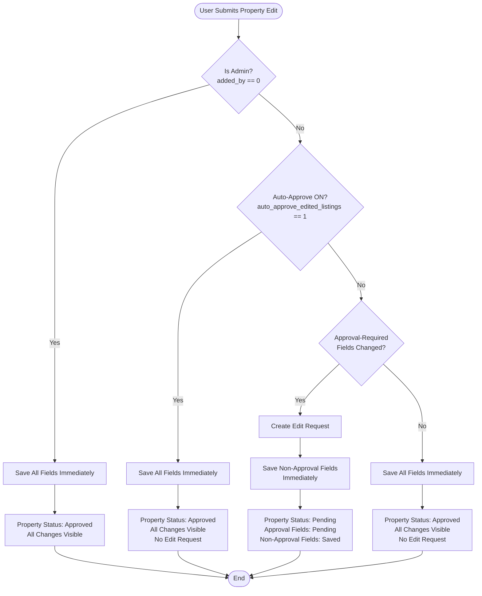
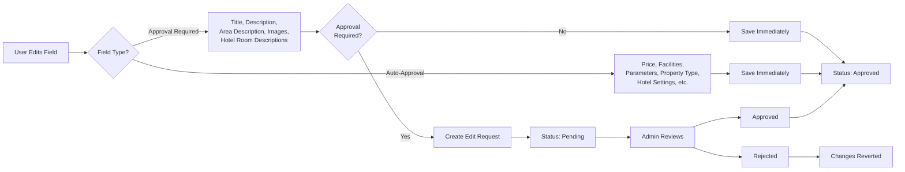
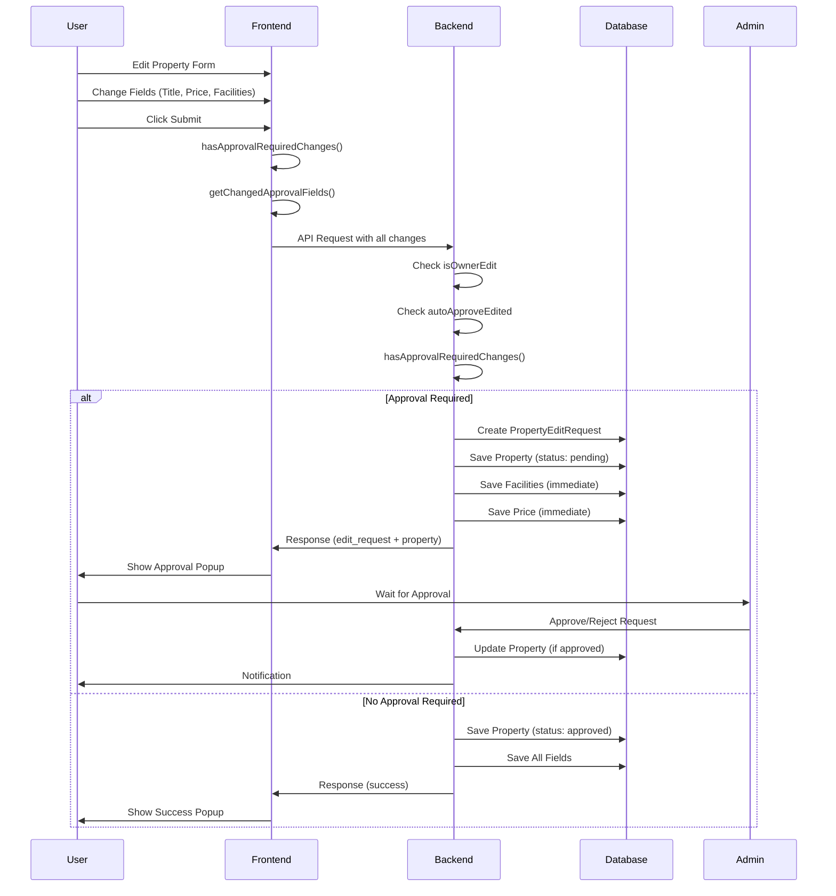
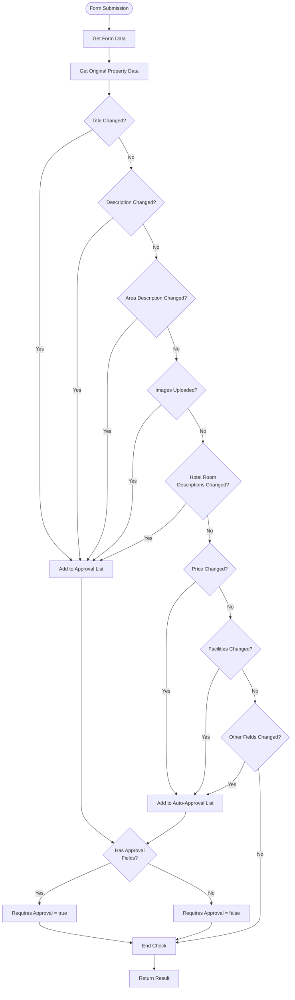
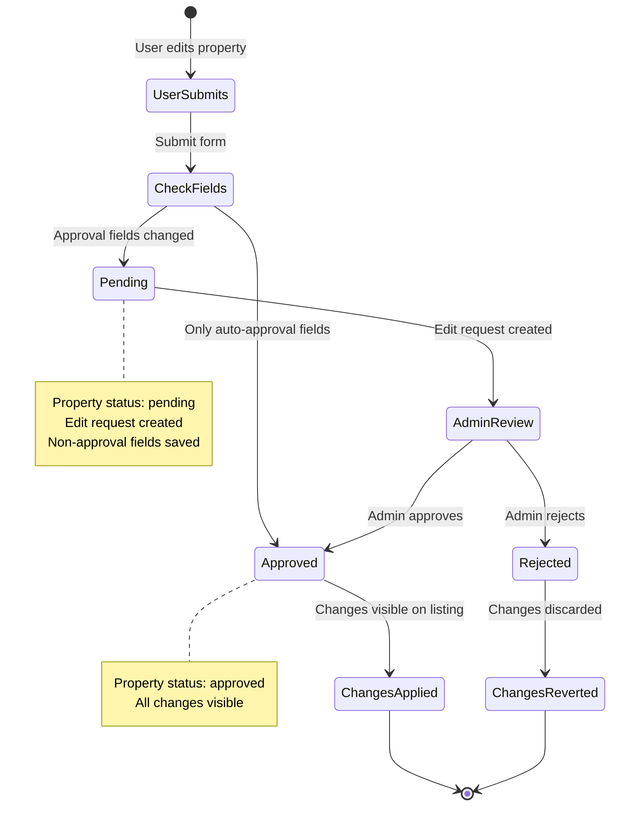
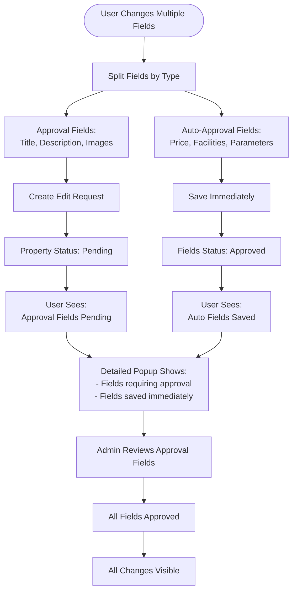
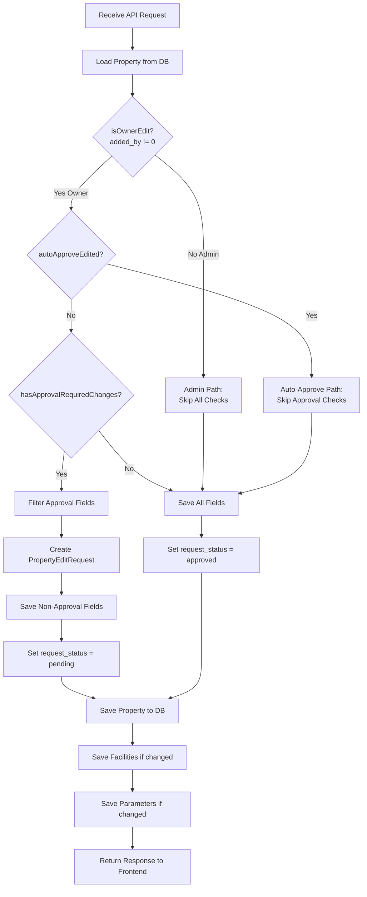

# Property Edit Flow Diagrams

## Overview
Visual representations of the property edit approval system using flow diagrams.

## 1. Main Decision Tree

## 2. Field Classification Flow

## 3. Complete Edit Process Flow

## 4. Field Change Detection Flow

## 5. Approval Request Lifecycle

## 6. User Type Comparison

```mermaid
flowchart TB
    subgraph AdminUser[Admin User]
        A1[Edit Property] --> A2[All Fields Editable]
        A2 --> A3[Save Directly]
        A3 --> A4[Status: Approved]
        A4 --> A5[Changes Visible Immediately]
    end
    
    subgraph OwnerAutoOn[Owner - Auto-Approve ON]
        O1[Edit Property] --> O2[All Fields Editable]
        O2 --> O3[Save Directly]
        O3 --> O4[Status: Approved]
        O4 --> O5[Changes Visible Immediately]
    end
    
    subgraph OwnerAutoOff[Owner - Auto-Approve OFF]
        P1[Edit Property] --> P2{Field Type?}
        P2 -->|Approval Required| P3[Create Edit Request]
        P2 -->|Auto-Approval| P4[Save Directly]
        P3 --> P5[Status: Pending]
        P4 --> P6[Status: Approved]
        P5 --> P7[Wait for Admin]
        P6 --> P8[Changes Visible Immediately]
        P7 --> P9[Admin Approves]
        P9 --> P10[Status: Approved]
        P10 --> P11[Changes Visible]
    end
    
    style AdminUser fill:#e1f5e1
    style OwnerAutoOn fill:#e1f5e1
    style OwnerAutoOff fill:#fff4e1
```

## 7. Mixed Field Changes Behavior

## 8. Backend Processing Flow

## Diagram Legend

### Colors
- **Green:** Immediate save/approved paths
- **Yellow:** Pending approval paths
- **Blue:** Decision points
- **Gray:** End states

### Shapes
- **Rectangle:** Process/action
- **Diamond:** Decision point
- **Rounded Rectangle:** Start/end state
- **Parallelogram:** Data/state

## Key Insights from Diagrams

1. **Three Main Paths:**
   - Admin: Always direct save
   - Owner + Auto-Approve ON: Always direct save
   - Owner + Auto-Approve OFF: Conditional (based on field types)

2. **Selective Approval:**
   - Only specific fields trigger approval
   - Other fields save immediately even when approval is required

3. **Mixed Behavior:**
   - When both types are changed, system handles them separately
   - User sees both immediate saves and pending approvals

4. **Clear Separation:**
   - Approval logic is separate from save logic
   - Non-approval fields always save immediately

